### Notes
o3-mini review excels at identifying structural and architectural issues, particularly around type system inconsistencies and interface duplications. Its strength lies in detecting misalignments between different parts of the codebase, like duplicate MCPServerConfig definitions and inconsistent capability handling. However, it tends to avoid implementation details and focuses more on suggesting high-level refactoring strategies and documentation improvements.

DeepSeek-v3's review demonstrates exceptional attention to protocol compliance and security features. It provides precise, actionable code examples with line numbers and clear explanations. The review is highly systematic, addressing each protocol requirement methodically and showing exactly where and how to implement missing features like versioning, timeouts, and authentication. Their suggestions are deeply technical and implementation-focused.

DeepSeek-R1 specializes in operational and security concerns, with particular attention to real-world deployment scenarios. Their review uniquely captures infrastructure-level details like environment variable formatting, GPU resource management, and authentication header requirements. They excel at identifying security implications of implementation choices and providing concrete fixes for production-grade deployments.

Claude-3.5-Sonnet approaches the review from a modern TypeScript perspective, emphasizing type safety and maintainable code patterns. Their review stands out for suggesting structural improvements using TypeScript features like enums, generics, and proper error hierarchies. They focus on future-proofing the codebase and implementing comprehensive protocol features while maintaining type safety.

Gemini-2.0-Pro takes a unique comparative analysis approach, systematically examining how similar functionality is implemented across different files. Their review excels at identifying inconsistencies in implementation patterns, particularly in server management approaches between different modules. They provide clear recommendations for unifying implementations and improving code organization, with a strong focus on maintainability and consistency.

# LLM Code Review Approaches Analysis

Based on evaluations from different LLM models, here's how their code review approaches differ and recommendations for effective usage:

## 1. o3-mini Review
**Approach Characteristics:**
- Focuses on structural inconsistencies between modules
- Identifies duplicate and conflicting type definitions
- Maps dependencies and integration points
- Provides architectural-level recommendations
- Emphasizes documentation and knowledge sharing

**Good For:**
- Initial architecture reviews
- Technical debt assessment
- API integration audits
- Cross-module dependency analysis
- Documentation gap identification

**Prompt Requirements:**
- Provide module dependency diagrams
- Include interface definitions
- Ask for "architectural consistency check"
- Use: "Map dependencies between components"
- Specify: "Identify interface duplications"

## 2. DeepSeek-v3 Review
**Approach Characteristics:**
- Protocol compliance verification
- Line-by-line code analysis
- Concrete implementation examples
- Security feature validation
- Detailed code snippets with context

**Good For:**
- Protocol implementation audits
- Security compliance checks
- Feature gap analysis
- Code-level documentation
- Implementation guidance

**Prompt Requirements:**
- Include protocol specifications
- Provide feature requirements
- Use: "Verify protocol compliance for feature X"
- Ask for "implementation examples"
- Specify: "Show exact code changes needed"

## 3. DeepSeek-R1 Review
**Approach Characteristics:**
- Security configuration analysis
- Resource management validation
- Environment variable handling
- Infrastructure integration checks
- Deployment requirement verification

**Good For:**
- Production deployment reviews
- Security configuration audits
- Resource optimization
- Infrastructure integration
- Configuration management

**Prompt Requirements:**
- Provide deployment requirements
- Include security policies
- Ask for "security configuration review"
- Use: "Validate resource configurations"
- Specify: "Check environment setup"

## 4. Claude-3.5-Sonnet Review
**Approach Characteristics:**
- Type system optimization
- Modern TypeScript patterns
- Comprehensive error handling
- Protocol feature implementation
- Code structure improvements

**Good For:**
- TypeScript modernization
- Error handling design
- API implementation
- Code quality improvement
- Type system design

**Prompt Requirements:**
- Share TypeScript configuration
- Include type definitions
- Ask for "type system optimization"
- Use: "Improve error handling patterns"
- Specify: "Modernize TypeScript code"

## 5. Gemini-2.0-Pro Review
**Approach Characteristics:**
- Cross-module implementation analysis
- Code pattern consistency checks
- Detailed file-by-file review
- Logic flow mapping
- Implementation unification strategies

**Good For:**
- Code consistency reviews
- Implementation pattern analysis
- Module integration checks
- Refactoring planning
- Code organization improvement

**Prompt Requirements:**
- Provide codebase structure
- Include implementation patterns
- Ask for "implementation consistency check"
- Use: "Compare module implementations"
- Specify: "Identify pattern variations"

---

# Recommendation Matrix

| Use Case                           | Recommended Model       | Prompt Tip                                           |
|-----------------------------------|------------------------|------------------------------------------------------|
| Protocol Compliance Audit          | DeepSeek-v3           | "Verify implementation of protocol feature X"         |
| Type System Modernization          | Claude-3.5-Sonnet     | "Optimize TypeScript types and error handling"        |
| Security Configuration Review      | DeepSeek-R1           | "Review security headers and auth configuration"      |
| Module Integration Analysis        | o3-mini               | "Check interface consistency between modules"         |
| Implementation Pattern Review      | Gemini-2.0-Pro        | "Compare feature implementations across files"        |
| Resource Configuration Audit       | DeepSeek-R1           | "Validate resource limits and env variables"          |
| Error Handling Design             | Claude-3.5-Sonnet     | "Design error hierarchy and handling patterns"        |
| Cross-Module Consistency          | Gemini-2.0-Pro        | "Find inconsistent implementation patterns"           |
| Architecture Documentation        | o3-mini               | "Document module dependencies and interfaces"         |
| Production Deployment Review      | DeepSeek-R1           | "Review deployment configuration and security"        |

**Critical Considerations:**
1. Use DeepSeek-v3 for detailed protocol implementation guidance
2. Leverage Claude-3.5-Sonnet for TypeScript modernization and type safety
3. Apply DeepSeek-R1 for security and deployment configuration
4. Use o3-mini for high-level architecture and integration analysis
5. Employ Gemini-2.0-Pro for implementation consistency checks

**Best Practices:**
1. Provide relevant documentation:
   - Protocol specifications for DeepSeek-v3
   - TypeScript configurations for Claude-3.5-Sonnet
   - Deployment requirements for DeepSeek-R1
   - Architecture diagrams for o3-mini
   - Implementation patterns for Gemini-2.0-Pro
2. Be specific in prompts about:
   - Which protocol features to verify
   - Which TypeScript patterns to modernize
   - Which security aspects to review
   - Which modules to analyze
   - Which implementation patterns to compare

# Development Cycle Integration

## Model Usage Throughout Software Development Lifecycle

### 1. o3-mini
**Development Phase:** Planning & Architecture
**Key Use Cases:**
- Initial system architecture review
- API contract validation
- Module dependency mapping
- Technical debt identification
- Documentation structure planning

**Example Workflow:**
```
Planning Phase -> o3-mini review of:
1. System architecture diagrams
2. API interface definitions
3. Module dependency graphs
4. Existing technical debt reports
Output: High-level architectural recommendations
```

### 2. DeepSeek-v3
**Development Phase:** Implementation & Protocol Compliance
**Key Use Cases:**
- Protocol feature implementation
- Security feature development
- API endpoint implementation
- Integration testing setup
- Compliance verification

**Example Workflow:**
```
Implementation Phase -> DeepSeek-v3 review of:
1. Protocol implementation code
2. Security features
3. API endpoints
4. Integration tests
Output: Detailed implementation fixes with code examples
```

### 3. DeepSeek-R1
**Development Phase:** Deployment & Operations
**Key Use Cases:**
- Deployment configuration review
- Security hardening
- Resource optimization
- Infrastructure setup
- Production readiness assessment

**Example Workflow:**
```
Pre-deployment Phase -> DeepSeek-R1 review of:
1. Deployment configurations
2. Security settings
3. Resource allocations
4. Infrastructure setup
Output: Production-ready configuration improvements
```

### 4. Claude-3.5-Sonnet
**Development Phase:** Code Quality & Maintenance
**Key Use Cases:**
- Type system design
- Error handling implementation
- Code modernization
- API design patterns
- Refactoring planning

**Example Workflow:**
```
Development Phase -> Claude-3.5-Sonnet review of:
1. TypeScript implementations
2. Error handling patterns
3. API designs
4. Legacy code modules
Output: Modern TypeScript patterns and improvements
```

### 5. Gemini-2.0-Pro
**Development Phase:** Code Review & Integration
**Key Use Cases:**
- Cross-module consistency checks
- Implementation pattern review
- Code organization analysis
- Integration point validation
- Refactoring validation

**Example Workflow:**
```
Review Phase -> Gemini-2.0-Pro analysis of:
1. Multiple implementation files
2. Module interactions
3. Code patterns
4. Integration points
Output: Consistency improvements and unification strategies
```

# Adoption of Anthropic's Agent Patterns

Based on Anthropic's research on building effective agents, here are recommendations for integrating their patterns with our LLM-based code review system:

## 1. Augmented LLM Pattern
**Implementation Strategy:**
- Use each LLM with specific augmentations:
  - o3-mini: Architecture documentation retrieval
  - DeepSeek-v3: Protocol specification access
  - DeepSeek-R1: Security policy integration
  - Claude-3.5-Sonnet: TypeScript best practices
  - Gemini-2.0-Pro: Codebase pattern analysis

## 2. Prompt Chaining Workflow
**Implementation Strategy:**
```
Architecture Review (o3-mini)
  ↓
Protocol Compliance (DeepSeek-v3)
  ↓
Type Safety Review (Claude-3.5-Sonnet)
  ↓
Implementation Consistency (Gemini-2.0-Pro)
  ↓
Deployment Review (DeepSeek-R1)
```

## 3. Routing Workflow
**Implementation Strategy:**
- Route code review tasks based on characteristics:
  - Architecture questions → o3-mini
  - Protocol implementation → DeepSeek-v3
  - Security configuration → DeepSeek-R1
  - TypeScript patterns → Claude-3.5-Sonnet
  - Code consistency → Gemini-2.0-Pro

## 4. Parallelization Workflow
**Implementation Strategy:**
- Parallel Security Review:
  ```
  DeepSeek-v3 (Protocol Security)
       ↓
  DeepSeek-R1 (Infrastructure Security)
       ↓
  Merge Security Findings
  ```
- Parallel Code Quality:
  ```
  Claude-3.5-Sonnet (Type Safety)
       ↓
  Gemini-2.0-Pro (Pattern Consistency)
       ↓
  Aggregate Quality Recommendations
  ```

## 5. Orchestrator-Workers Pattern
**Implementation Strategy:**
Use Claude-3.5-Sonnet as orchestrator to:
1. Break down complex changes
2. Delegate to specialized workers:
   - o3-mini for architecture impact
   - DeepSeek-v3 for protocol changes
   - DeepSeek-R1 for security implications
   - Gemini-2.0-Pro for consistency checks

## 6. Evaluator-Optimizer Pattern
**Implementation Strategy:**
```
Primary Review (Model A)
       ↓
Evaluation (Model B)
       ↓
Optimization (Model A)
```
Example Pairs:
- Architecture: o3-mini (Review) + Claude-3.5-Sonnet (Evaluate)
- Security: DeepSeek-R1 (Review) + DeepSeek-v3 (Evaluate)
- Implementation: Gemini-2.0-Pro (Review) + Claude-3.5-Sonnet (Evaluate)

## Best Practices for Pattern Implementation

1. **Start Simple:**
   - Begin with single-model reviews
   - Add complexity only when needed
   - Measure improvement in review quality

2. **Maintain Transparency:**
   - Document which model reviewed what
   - Keep clear review chains
   - Track review decisions

3. **Enable Human Oversight:**
   - Add checkpoints between patterns
   - Allow manual review interventions
   - Maintain approval workflows

4. **Optimize for Efficiency:**
   - Use parallel reviews when possible
   - Implement caching for common checks
   - Reuse review results across patterns

# Visual Representations

## Development Cycle Overview
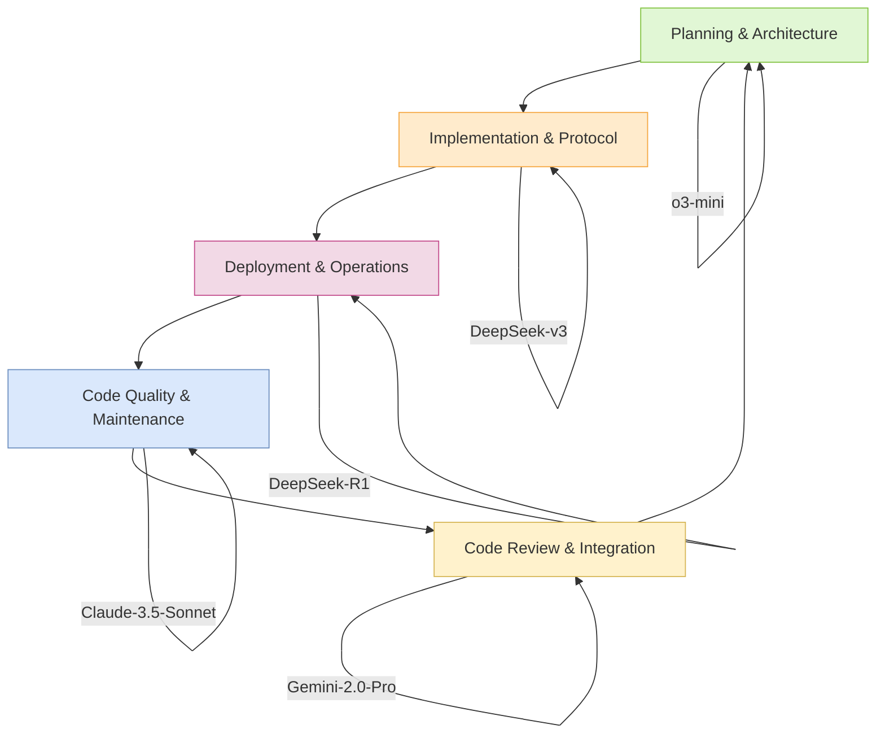

## Model Specialization Map
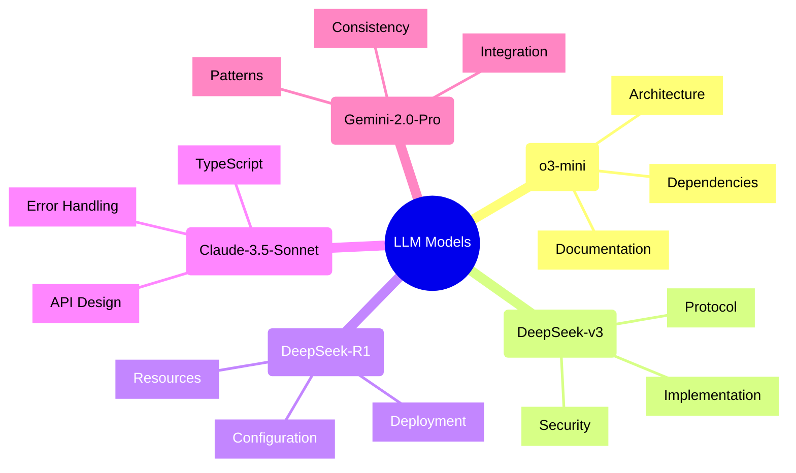

## Workflow Patterns

### Prompt Chaining Flow
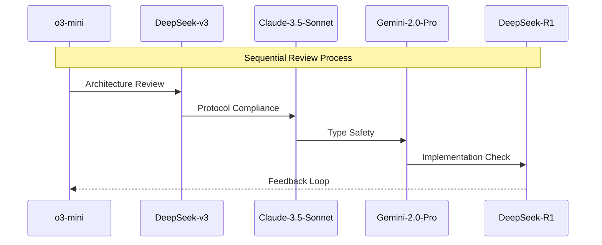

### Routing Decision Flow
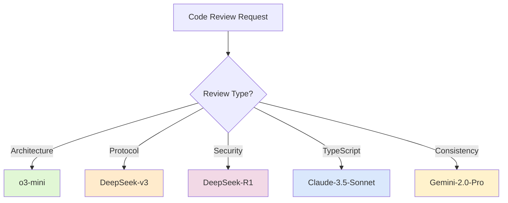

### Parallel Review Process
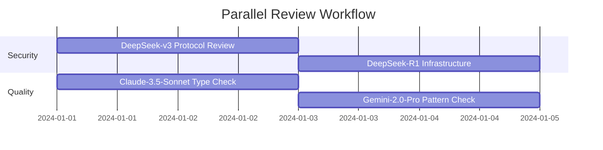

### Orchestrator-Workers Pattern
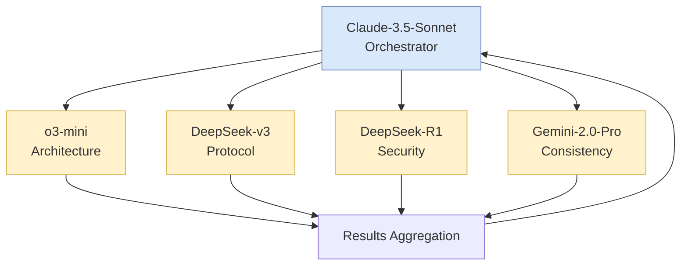

### Evaluator-Optimizer Flow
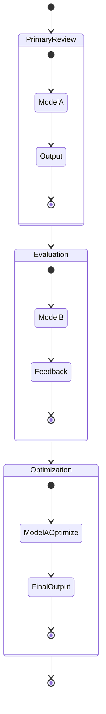

## Integration Points Matrix
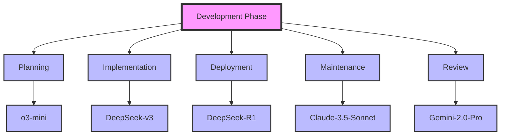

## Use cases

### Cursor IDE
#### Enhancing Code Review with Cursor IDE and Composer Agent Mode

Leveraging Cursor IDE's features, especially the Composer Agent Mode, can significantly streamline and enhance the LLM-based code review process. Here's how we can integrate the previously defined models and workflows:

**1. Composer Agent Mode with Claude-3.5-Sonnet:**

*   **Setup:** Designate Claude-3.5-Sonnet as the primary agent within Cursor IDE's Composer Agent Mode. This leverages its strengths in understanding complex instructions, managing workflows, and generating high-quality TypeScript code.

*   **Orchestration:** Claude-3.5-Sonnet acts as the orchestrator, breaking down review tasks into smaller, manageable sub-tasks. It then delegates these sub-tasks to specialized worker models.

*   **Task Delegation:**  Use Cursor's interface to define the roles of other models:
    *   **o3-mini:**  Architecture and dependency analysis.  Claude-3.5 can prompt o3-mini with requests like, "Analyze the architecture of this module and identify potential conflicts." or using the `@` symbol in the chat interface to direct the prompt to o3-mini.
    *   **DeepSeek-v3:** Protocol compliance and security feature implementation.  Example prompt: "Verify the protocol implementation in `server.ts` against the specification document."
    *   **DeepSeek-R1:** Deployment and security configuration review. Example: "Review the Dockerfile and Kubernetes configuration for security vulnerabilities."
    *   **Gemini-2.0-Pro:** Code consistency and pattern checks.  Example: "Compare the implementation of `createUser` in `user.ts` and `admin.ts` and highlight inconsistencies."

*   **Instruction Execution:** Claude-3.5-Sonnet, within Composer, can directly execute commands within the Cursor IDE, such as:
    *   Running tests: "Execute all unit tests in the `auth` module."
    *   Generating code: "Implement the `forgotPassword` function according to the protocol specification."
    *   Refactoring: "Refactor the `MCPServerConfig` type to eliminate duplication."
    *   Fetching files: "Get the content of file `src/server/config.ts`"

* **Feedback Loop:**
    - Use the Evaluator-Optimizer pattern. After a worker model provides its review/output, Claude-3.5-Sonnet can prompt another model (or the same model) to evaluate the output and suggest improvements. For example, after DeepSeek-R1 reviews a deployment configuration, Claude-3.5 might ask DeepSeek-v3 to evaluate the security implications of the configuration.
    - Claude-3.5 can use Cursor's diff view to present changes suggested by the worker models, allowing for easy review and acceptance/rejection by the developer.

**2.  Workflow Examples within Cursor IDE:**

*   **New Feature Review:**
    1.  Developer adds a new feature branch.
    2.  Claude-3.5-Sonnet (in Composer) receives the instruction: "Review the new feature in branch `feature/new-api`."
    3.  Claude-3.5 breaks this down:
        *   "o3-mini, analyze the architectural impact of the changes in `feature/new-api`."
        *   "DeepSeek-v3, verify the protocol compliance of the new API endpoints in `feature/new-api`."
        *   "Gemini-2.0-Pro, check for consistency issues between the new code and existing modules in `feature/new-api`."
        *   "DeepSeek-R1, assess the security implications of the changes and review the updated deployment configuration."
    4.  Claude-3.5 aggregates the results, presents them to the developer, and facilitates iterative improvements based on the feedback.

*   **Refactoring Task:**
    1.  Developer highlights a section of code needing refactoring.
    2.  Claude-3.5 (in Composer) receives: "Refactor this code for better type safety and maintainability."
    3.  Claude-3.5 might:
        *   "Claude-3.5-Sonnet, suggest improvements to the type definitions and error handling."
        *   "Gemini-2.0-Pro, identify any inconsistencies introduced by this refactoring compared to other parts of the codebase."
    4.  Claude-3.5 presents the refactored code, highlighting the changes.

*   **Security Audit:**
    1.  Triggered manually or by a CI/CD pipeline.
    2.  Claude-3.5: "Perform a security audit of the codebase."
    3.  Claude-3.5 delegates:
        *   "DeepSeek-R1, review all configuration files for security vulnerabilities."
        *   "DeepSeek-v3, verify that all API endpoints implement proper authentication and authorization."
    4.  Claude-3.5 compiles a security report.

**3.  Leveraging Cursor IDE's Features:**

*   **Chat Interface:** Use the chat interface to interact with Claude-3.5-Sonnet and other models.  Use `@model-name` to direct prompts to specific models.
*   **Code Autocompletion:**  Claude-3.5 can leverage its understanding of the codebase and the review context to provide intelligent code autocompletions.
*   **Inline Editing:**  Accept, reject, or modify suggestions directly within the code editor.
*   **Diff View:**  Visualize the changes proposed by the LLMs.
*   **Debugging Tools:**  Use Cursor's debugging tools to step through code and understand the LLMs' reasoning.
* **Test execution:** Run the test and report the results.

**4.  Prompt Engineering within Cursor:**

*   **Contextual Prompts:**  Cursor automatically provides context to the LLMs (current file, selected code, etc.).  Leverage this by crafting prompts that refer to this context.  For example, "Given the selected function, suggest improvements for error handling."
*   **Specific Instructions:**  Be precise in your instructions. Instead of "Review this code," use "Check this code for compliance with the XYZ protocol, focusing on error handling and security."
*   **Iterative Refinement:**  Use the chat interface to iteratively refine the LLMs' output.  If the initial response isn't satisfactory, provide feedback and ask for specific changes.

By combining the specialized capabilities of different LLM models with Cursor IDE's interactive features and Composer Agent Mode, we can create a highly efficient and effective code review system that significantly improves code quality, security, and maintainability. The key is to use Claude-3.5-Sonnet as the central orchestrator, leveraging its ability to manage complex workflows and interact with the IDE.

# Model-Specific Prompt Examples

## o3-mini Prompts
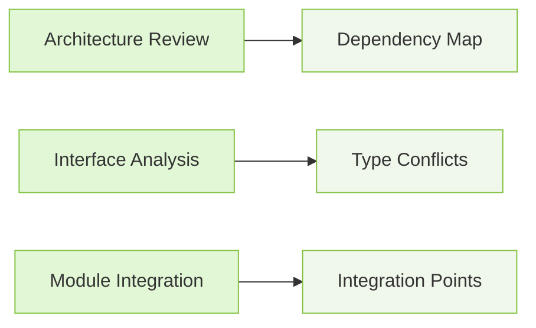

**High-Level Architecture:**
```typescript
// Input: Project structure and core modules
"Analyze the dependency relationships between core modules:
- Map direct and indirect dependencies
- Identify circular dependencies
- Highlight potential architectural bottlenecks
Focus on: src/core/, src/transport/, src/health/"
```

**Interface Consistency:**
```typescript
// Input: Multiple interface definitions
"Compare interface definitions across the codebase:
- Find duplicate or conflicting type definitions
- Identify inconsistent property names/types
- Suggest interface consolidation opportunities
Example files: src/types/, src/models/"
```

**Module Integration:**
```typescript
// Input: Integration points between modules
"Review the integration points between modules:
- Validate API contract consistency
- Check for proper error propagation
- Identify missing type definitions at boundaries
Key areas: src/client/ <-> src/server/"
```

## DeepSeek-v3 Prompts
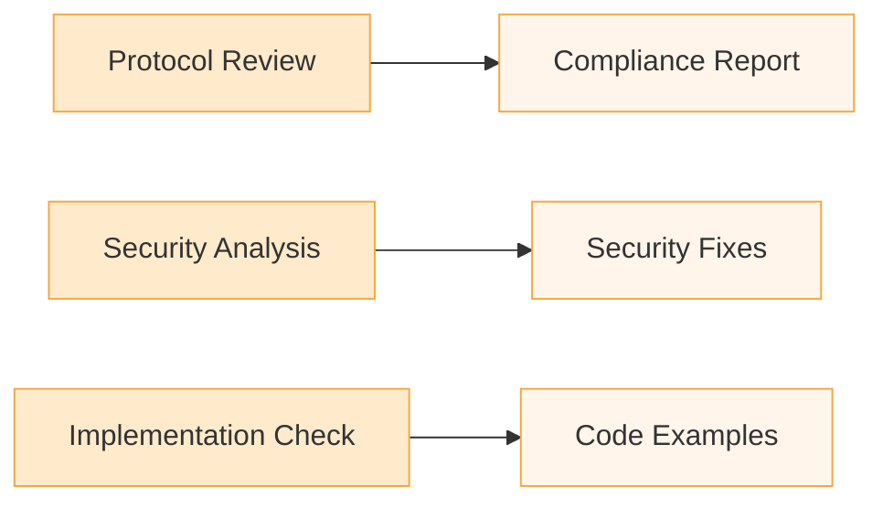

**Protocol Compliance:**
```typescript
// Input: Protocol implementation code
"Verify protocol compliance in MCPClient implementation:
- Check all required protocol features
- Validate message format and structure
- Ensure proper version handling
Reference: MCP Protocol v1.2, Section 4.3"
```

**Security Features:**
```typescript
// Input: Security-critical code
"Review authentication implementation:
- Verify token validation logic
- Check for proper encryption usage
- Validate secure communication setup
Focus on: src/auth/*, src/crypto/*"
```

**Implementation Details:**
```typescript
// Input: Specific feature implementation
"Analyze feature implementation against spec:
- Verify all edge cases are handled
- Check error handling completeness
- Validate resource cleanup
Example: src/transport/transport-factory.ts"
```

## DeepSeek-R1 Prompts
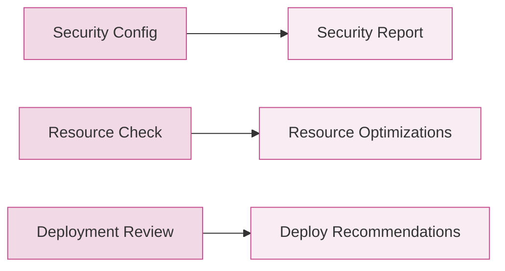

**Security Configuration:**
```typescript
// Input: Configuration files
"Review security configuration:
- Validate TLS settings
- Check authentication headers
- Verify secure defaults
Files: config/*.yaml, src/config/security.ts"
```

**Resource Management:**
```typescript
// Input: Resource configuration
"Analyze resource management:
- Review memory allocation settings
- Check CPU utilization patterns
- Validate connection pooling
Focus: src/resource/*, deployment/*.yaml"
```

**Deployment Setup:**
```typescript
// Input: Deployment configuration
"Evaluate deployment configuration:
- Verify environment variables
- Check container security settings
- Validate resource limits
Files: Dockerfile, kubernetes/*.yaml"
```

## Claude-3.5-Sonnet Prompts
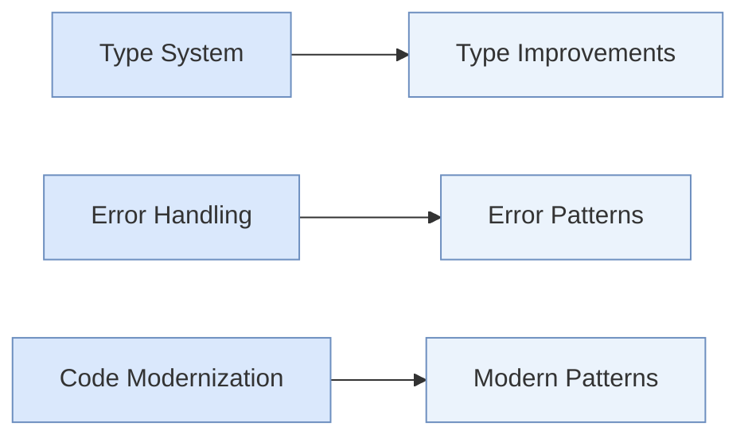

**Type System Enhancement:**
```typescript
// Input: TypeScript code
"Optimize type system usage:
- Implement proper generics
- Add type guards where needed
- Improve type inference
Example: src/types/server-config.ts"
```

**Error Handling:**
```typescript
// Input: Error handling code
"Review error handling patterns:
- Implement proper error hierarchy
- Add type-safe error handling
- Improve error messages
Focus: src/error/mcp-errors.ts"
```

**Code Modernization:**
```typescript
// Input: Legacy TypeScript code
"Modernize TypeScript implementation:
- Use latest TS features
- Implement proper async patterns
- Add null safety checks
Files: src/legacy/*.ts"
```

## Gemini-2.0-Pro Prompts
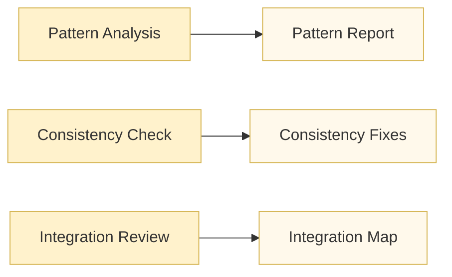

**Pattern Analysis:**
```typescript
// Input: Multiple implementation files
"Compare implementation patterns:
- Identify common patterns
- Find pattern variations
- Suggest pattern unification
Scope: src/handlers/*, src/controllers/*"
```

**Consistency Review:**
```typescript
// Input: Related code files
"Check implementation consistency:
- Compare error handling approaches
- Verify naming conventions
- Review method signatures
Files: src/services/*.ts"
```

**Integration Analysis:**
```typescript
// Input: Integration code
"Analyze integration patterns:
- Map data flow between modules
- Check error propagation
- Verify event handling
Focus: src/events/, src/handlers/"
```

## Best Practices for Prompt Construction

1. **Context Setting:**
   ```typescript
   // Good
   "Given the MCP protocol v1.2 specification, review the implementation in src/transport/"
   
   // Bad
   "Review the transport code"
   ```

2. **Scope Definition:**
   ```typescript
   // Good
   "Analyze error handling in src/error/mcp-errors.ts, focusing on type safety"
   
   // Bad
   "Check the error handling"
   ```

3. **Output Specification:**
   ```typescript
   // Good
   "Provide specific code examples for each identified issue, including file location and line numbers"
   
   // Bad
   "List the problems you find"
   ```

4. **Reference Material:**
   ```typescript
   // Good
   "Using the TypeScript best practices guide v4.9, suggest improvements for src/types/"
   
   // Bad
   "Make the types better"
   ```

These prompt examples are designed to maximize each model's strengths while maintaining consistency in output format and quality. The visual representations help understand the flow from prompt to output for each model type.

## Podman Desktop API-Specific Examples

### o3-mini - Architecture Analysis
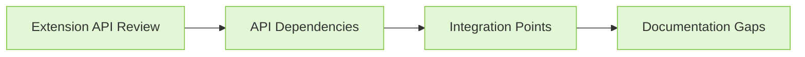

**Podman Extension Architecture:**
```typescript
// Input: Extension structure and Podman Desktop API usage
"Analyze the extension's integration with Podman Desktop API:
- Map extension point usage (@podman-desktop/api)
- Identify provider registration patterns
- Review lifecycle management approach
Focus on:
- Extension activation events
- Provider registration
- Command contributions
Files: src/extension.ts, package.json"
```

### DeepSeek-v3 - Protocol Implementation
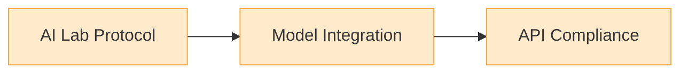

**AI Lab Integration:**
```typescript
// Input: AI Lab integration code
"Verify Podman AI Lab protocol implementation:
- Check model service integration
- Validate playground API usage
- Ensure proper recipe structure
Reference files:
- ai-lab.yaml
- src/model-servers/
- app/chatbot_ui.py
Focus on:
- Model service configuration
- Container definitions
- Port mappings"
```

### DeepSeek-R1 - Container Security


**Podman Container Security:**
```typescript
// Input: Container configuration
"Review container security settings:
- Validate container isolation
- Check resource quotas
- Verify network policies
Files:
- Containerfile
- kubernetes/*.yaml
- app/config/security.ts
Focus on:
- Container privileges
- Resource constraints
- Network access controls"
```

### Claude-3.5-Sonnet - Extension Types
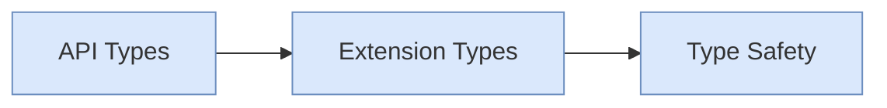

**Podman Desktop Types:**
```typescript
// Input: Extension type definitions
"Enhance type safety for Podman Desktop extension:
- Implement proper Provider interface
- Type-safe command registrations
- Extension context typing
Files:
- src/types/podman-desktop.d.ts
- src/provider/provider-impl.ts
Focus on:
- Provider lifecycle types
- Command contribution types
- Extension context usage"
```

### Gemini-2.0-Pro - Extension Patterns
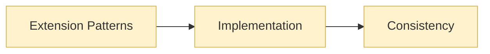

**Extension Implementation Patterns:**
```typescript
// Input: Extension implementation files
"Analyze Podman Desktop extension patterns:
- Compare provider implementations
- Review command registration approaches
- Check extension activation patterns
Files:
- src/extension.ts
- src/provider/*.ts
Focus on:
- Provider registration consistency
- Command contribution patterns
- Resource cleanup approaches"
```

These examples demonstrate how each model's strengths can be applied specifically to Podman Desktop extension development, focusing on:
- Architecture and API integration (o3-mini)
- AI Lab protocol compliance (DeepSeek-v3)
- Container security and resources (DeepSeek-R1)
- Type safety with Podman Desktop API (Claude-3.5-Sonnet)
- Extension implementation patterns (Gemini-2.0-Pro)

## AI Lab Extension Code Review Examples

### o3-mini - Architecture Review
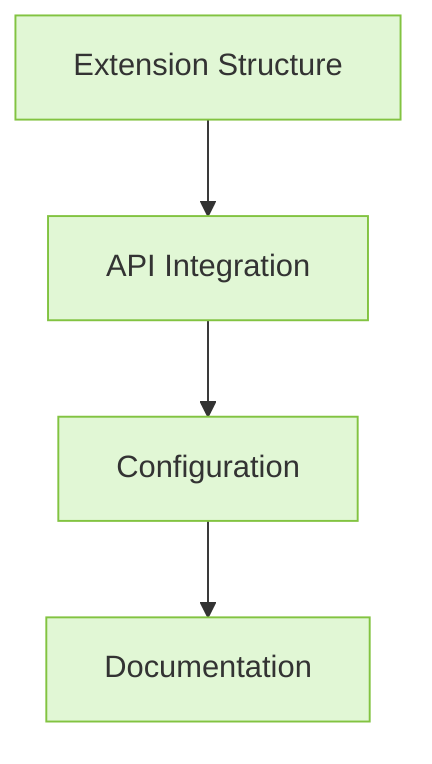

**Architecture Analysis:**
```typescript
// Input: AI Lab Extension PR
"Review architectural changes in the AI Lab extension:
- Analyze extension activation flow
- Check configuration structure
- Validate API integration patterns
Focus on:
- Extension lifecycle in extension.ts
- Configuration in package.json
- Command registration patterns
Key concerns:
- Separation of concerns
- Module dependencies
- API usage consistency"
```

### DeepSeek-v3 - Protocol Implementation
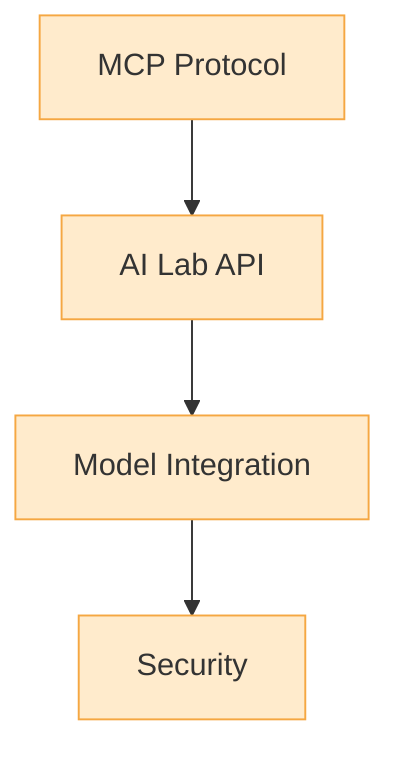

**Protocol Compliance:**
```typescript
// Input: AI Lab Integration Code
"Verify AI Lab protocol implementation:
- Check model service integration
- Validate system prompt handling
- Review playground API usage
Focus on:
- ai-lab.yaml configuration
- Model service setup
- Container definitions
Key files:
- src/extension.ts
- src/mcp-server-service.ts
Specific concerns:
- Protocol versioning
- Authentication headers
- Error propagation"
```

### DeepSeek-R1 - Deployment Security
```mermaid
graph TB
    classDef sec fill:#f2d9e6,stroke:#c44d8d
    A[Container Config]:::sec --> B[Resource Management]:::sec
    B --> C[Security Settings]:::sec
    C --> D[Environment]:::sec
```

**Security Configuration:**
```typescript
// Input: AI Lab Deployment Files
"Review AI Lab security configuration:
- Analyze container isolation
- Check resource quotas
- Verify environment variables
Focus on:
- Containerfile changes
- Package.json updates
- Extension configuration
Security aspects:
- Model isolation
- Resource limits
- Access controls
- Environment validation"
```

### Claude-3.5-Sonnet - Type System
```mermaid
graph TB
    classDef type fill:#dae8fc,stroke:#6c8ebf
    A[Type Definitions]:::type --> B[API Types]:::type
    B --> C[Error Handling]:::type
    C --> D[Integration Types]:::type
```

**Type System Review:**
```typescript
// Input: AI Lab TypeScript Code
"Analyze type system implementation:
- Review MCP client types
- Check error handling patterns
- Validate API integration types
Focus on:
- Type definitions in extension.ts
- Error handling in server service
- API integration types
Key improvements:
- Generic type usage
- Error type hierarchy
- Type guard implementation
Files to review:
- src/extension.ts
- src/mcp-types.ts
- src/mcp-server-service.ts"
```

### Gemini-2.0-Pro - Implementation Patterns
```mermaid
graph TB
    classDef pattern fill:#fff2cc,stroke:#d6b656
    A[Code Patterns]:::pattern --> B[Integration]:::pattern
    B --> C[Consistency]:::pattern
    C --> D[Documentation]:::pattern
```

**Pattern Analysis:**
```typescript
// Input: AI Lab Implementation
"Compare implementation patterns across AI Lab extension:
- Analyze command registration
- Review service initialization
- Check error handling consistency
Focus on:
- Extension activation patterns
- Service lifecycle management
- Error handling approaches
Pattern categories:
- Command registration
- Service initialization
- Resource cleanup
Files:
- src/extension.ts
- src/mcp-server-service.ts
- src/mcp-server-manager.ts"
```

## Decision Flow for AI Lab Extension Review

```mermaid
flowchart TB
    classDef arch fill:#e1f7d5,stroke:#82c341
    classDef proto fill:#ffebcc,stroke:#f5a742
    classDef sec fill:#f2d9e6,stroke:#c44d8d
    classDef type fill:#dae8fc,stroke:#6c8ebf
    classDef pattern fill:#fff2cc,stroke:#d6b656

    Start[PR Review] --> Arch[Architecture Review]:::arch
    Arch --> Proto[Protocol Check]:::proto
    Proto --> Sec[Security Audit]:::sec
    Sec --> Type[Type System]:::type
    Type --> Pattern[Pattern Analysis]:::pattern
    
    Arch -- o3-mini --> ArchReport[Structure Report]
    Proto -- DeepSeek-v3 --> ProtoReport[Protocol Report]
    Sec -- DeepSeek-R1 --> SecReport[Security Report]
    Type -- Claude-3.5 --> TypeReport[Type Report]
    Pattern -- Gemini --> PatternReport[Pattern Report]
    
    ArchReport --> Final[Final Review]
    ProtoReport --> Final
    SecReport --> Final
    TypeReport --> Final
    PatternReport --> Final
```

## Review Workflow Integration

1. **Initial Architecture Review (o3-mini)**
   ```typescript
   // Check extension structure
   "Analyze changes in:
   - Extension activation flow
   - Command registration
   - Service initialization
   Focus: Architectural impact of AI Lab integration"
   ```

2. **Protocol Compliance (DeepSeek-v3)**
   ```typescript
   // Verify protocol implementation
   "Review:
   - Model service integration
   - AI Lab API usage
   - System prompt handling
   Focus: Protocol alignment and versioning"
   ```

3. **Security Configuration (DeepSeek-R1)**
   ```typescript
   // Audit security settings
   "Check:
   - Container configuration
   - Resource limits
   - Environment variables
   Focus: Security implications of AI Lab integration"
   ```

4. **Type System Review (Claude-3.5-Sonnet)**
   ```typescript
   // Analyze type safety
   "Evaluate:
   - Type definitions
   - Error handling
   - API integration types
   Focus: Type system improvements for AI Lab"
   ```

5. **Pattern Analysis (Gemini-2.0-Pro)**
   ```typescript
   // Review implementation patterns
   "Compare:
   - Command handling
   - Service lifecycle
   - Resource management
   Focus: Consistency in AI Lab implementation"
   ```

## Review Outcome Matrix

| Aspect | Model | Focus Area | Key Findings |
|--------|-------|------------|--------------|
| Architecture | o3-mini | Extension Structure | Command registration patterns, service initialization |
| Protocol | DeepSeek-v3 | AI Lab Integration | Model service setup, system prompt handling |
| Security | DeepSeek-R1 | Container Config | Resource limits, environment variables |
| Types | Claude-3.5-Sonnet | Type System | Error handling, API integration types |
| Patterns | Gemini-2.0-Pro | Implementation | Service lifecycle, resource management |

These examples demonstrate how each model's unique strengths can be applied to reviewing different aspects of the AI Lab extension, ensuring comprehensive coverage of all critical areas.


