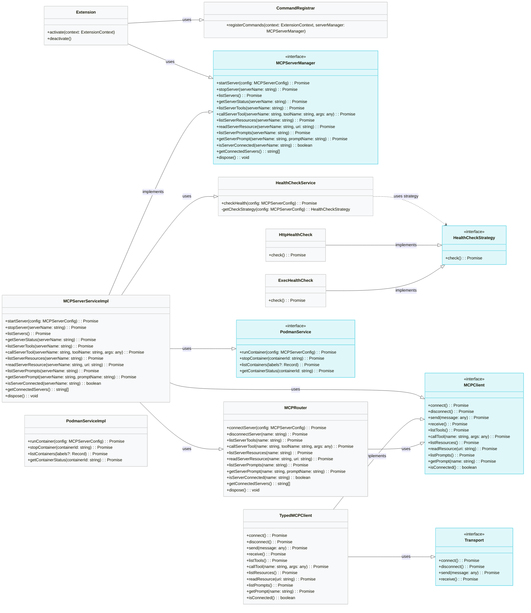
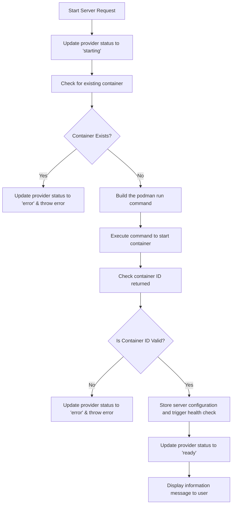
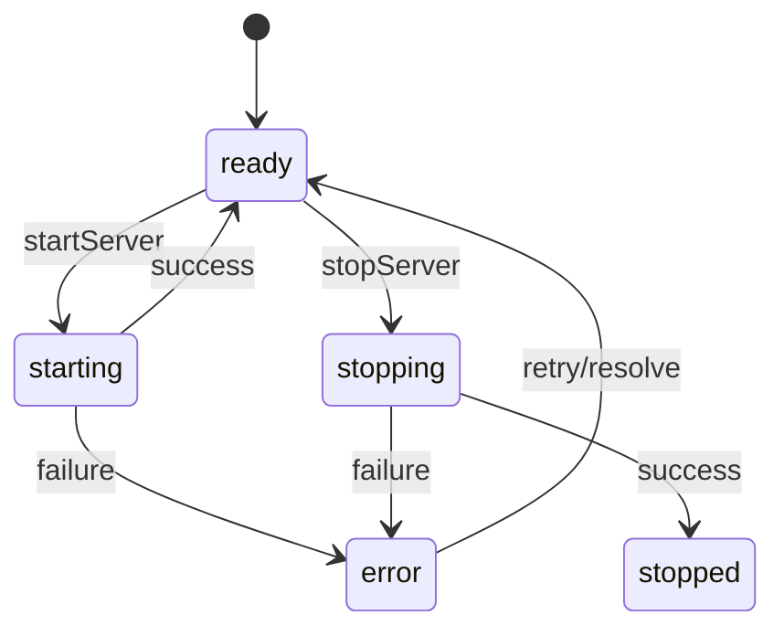
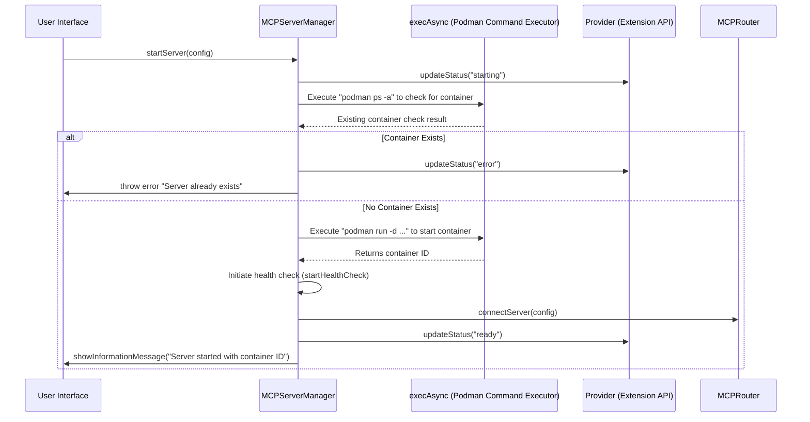
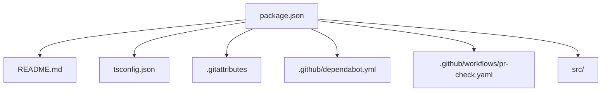

# Architecture and Design Diagrams

This document provides an overview of the project's architecture and source code design for the MCP Server Manager Extension.

It is organized as follows:

- A brief explanation of the source code structure.
- A **Class Diagram** showing key classes and their relationships.
- A **Flowchart** that illustrates the sequence of operations when starting a server.
- A **State Machine Diagram** describing the different provider statuses.
- A **Sequence Diagram** representing the interactions that occur during the server start process.
- A **Package Diagram** that shows the repository structure (based on `package.json` and related files).

> **Note:** If some parts need further refinement, please replace the placeholder comments with more detailed information and diagrams.

---

## Source Code Structure Overview

The project is organized as follows:

- **src/**
  - **core/**
    - `mcp-client.ts`: Contains the MCP client implementations and the client factory.
  - **health/**
    - `health-check.service.ts`: Implements health check strategies using HTTP GET or exec commands.
  - **settings/**
    - `MCPSettings.ts`: Manages extension configuration settings.
  - **types/**
    - `mcp-types.ts`: Declares types and interfaces for MCP server configurations, errors, etc.
    - `modelcontextprotocol-sdk.d.ts`: Provides type definitions for the external MCP SDK.
  - **ui/**
    - `MCPServerManager.tsx`: React component for the MCP Server Manager user interface.
  - Root-level source files:
    - `mcp-server-manager.ts`: Main class that handles server lifecycle operations (start/stop, health checks).
    - `mcp-server-service.ts`: Provides higher-level operations for managing MCP servers.
    - `mcp-router.ts`: Routes commands to appropriate MCP clients.
- **.github/** folder and other files (e.g., `package.json`, `tsconfig.json`, etc.) handle project configuration, CI, and dependency management.

---

## Mermaid Diagrams

### 1. Class Diagram

This diagram shows the key classes and their interdependencies.

---

### 2. Flowchart Diagram

This flowchart illustrates the major steps when a user requests to start a server.

---

### 3. State Machine Diagram

This diagram represents the provider status transitions during server lifecycle operations.

---

### 4. Sequence Diagram

This diagram shows the sequence of interactions when a server is started.

---

### 5. Package Diagram

This diagram outlines the repository's package-related files and their high-level relationships.

---

## Placeholders & Instructions for Further Detail

If any of the diagrams or sections require further detail, please insert the following instructions at the appropriate locations:

- **[Placeholder for Extended Class Diagram]:**  
  _"Please expand the class diagram to include additional classes (for example, error classes and mocks) and their relationships where applicable. Include methods and properties that are critical for understanding interactions."_

- **[Placeholder for Extended Package Diagram]:**  
  _"Detail the relationship between the build tools (pnpm, eslint, jest) and the configuration files. Include any additional files like `.editorconfig` or custom scripts if present in the repository."_ 

- **[Additional Flow Details]:**  
  _"Include any additional branches or error handling paths that were merged after the recent feature updates. Verify that the container lifecycle (start/stop/dispose) is fully represented."_

Please replace these placeholders with finalized diagrams and detailed comments before release.

---

This documentation should serve as a strong foundation for understanding the project architecture and guiding further development.

Happy documenting! 